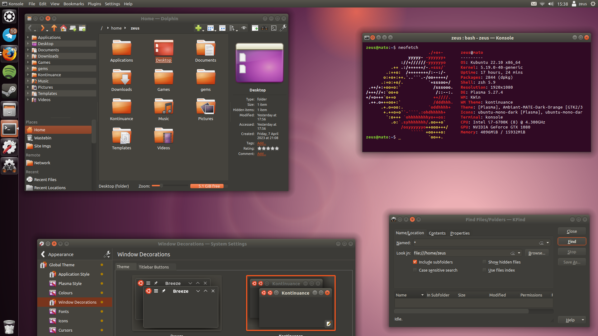
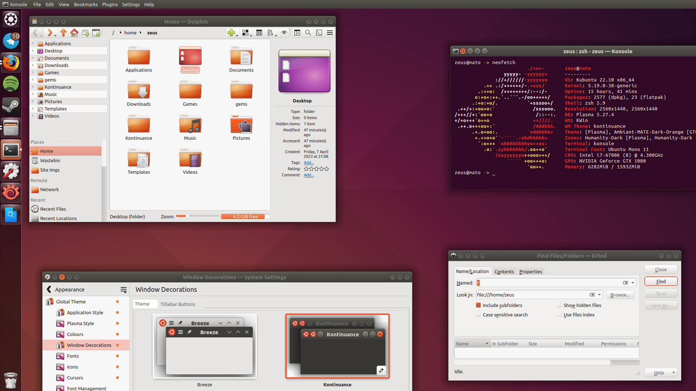

# Kontinuance

a contintuation of the ubuntu ~17 ambiance theme

included

* window decoration (aurorae) theme
	* window buttons drawn over the official unity icons
* qtcurve application style
	* modified from [blender ambiance](https://www.pling.com/p/1136954) "extras" qtcurve style
* wallpapers
	* svg recreations of older ubuntu wallpapers
* dark colour scheme (semi-wip)
	* most colours taken from [Ambiant-MATE-Dark-Orange](https://github.com/lah7/Ambiant-MATE-Colours#installation)

not included

* icon pack
	* recommended: [Humanity/Humanity-Dark](https://ubuntu.pkgs.org/18.04/ubuntu-main-amd64/humanity-icon-theme_0.6.15_all.deb.html)
* light colour scheme
	* recommended: [ambiance-ISH](https://store.kde.org/p/1001434/) (see second screenshot)
* gtk theme
	* recommended: [Ambiant-MATE-Colours](https://github.com/lah7/Ambiant-MATE-Colours)/[-Dark-Orange](https://github.com/lah7/Ambiant-MATE-Colours#installation)
	* (though the window buttons get cut off in firefox, which doesn't happen with the official ambiance theme..?)
* cursor theme
	* recommended: [Oxygen Orange Carnelian](https://www.deviantart.com/lavalon/art/Oxygen-Cursors-76614092) / White
	* ([[unofficial?] github](https://github.com/wo2ni/Oxygen-Cursors))

---

originally started as a fix for [blender ambiance](https://www.pling.com/p/1136954); but in the end i found it easier to recreate from scratch
