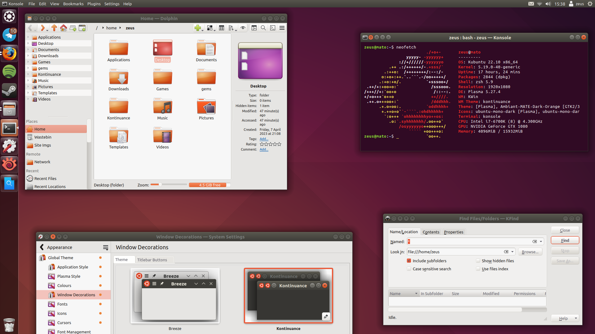

# Kontinuance

a continuation of the ubuntu ~17 ambiance theme for kde plasma 5

### installation
#### simple
* copy all 4 folders to `~/.local/share/`
* install qtcurve with your system package manager
	* select qtcurve application style via system settings, and select "configure style"
	* "kontinuance" should appear in the presets dropdown
* [optionally] run `install-reccs.sh`
	* which installs
		* ubuntu-mono icons
		* humanity icons
		* ambiant-mate-dark-orange gtk theme
	+ and edits the inheritance line, so that they inherit
		* oxygen/gnome (if installed) -- fewer symbolic icons
		* breeze-dark (ubuntu-mono-dark only) -- no more black monochrome icons
	* **NB** i am not good at writing bash scripts. caveat emptor.
#### manual
* window decorations
	* copy the `aurorae/themes/kontinuance/` folder to `.local/share/aurorae/themes/`
* colourscheme
	* install the `color-schemes/kontinuance.colors` file via system settings
* qtcurve theme
	* install qtcurve with your system package manager
		* select qtcurve application style via system settings, and select "configure style"
		* select import, and choose the file `qtcurve/kontinuance.qtcurve`

### recommended settings
* window border size: tiny, or no side borders
	* resizing from the top edge seems to be bugged with "no borders" in aurorae, it happens in all themes?
* window buttons size: normal
	* 20px icons

### what it is, what it is
* window decoration (aurorae) theme
	* window buttons faithful to the official unity icons
* qtcurve application style
	* which i chose over kvantum as it allows inheriting from standard plasma colours
	* modified from [blender ambiance](https://www.pling.com/p/1136954) "extras" qtcurve style
* wallpapers
	* svg recreations of older ubuntu wallpapers
* dark colour scheme (semi-wip)
	* most colours taken from [Ambiant-MATE-Dark-Orange](https://github.com/lah7/Ambiant-MATE-Colours#installation)

### what it isn't, what it isn't
* plasma shell theme:
	* recommended:
		* [unity ambiance theme](https://www.pling.com/p/998797/)
		* [blender ambiance plasma theme](https://store.kde.org/p/1136954/) (extras.zip) if you don't like transparency
* icon pack
	* recommended:
		* [ubuntu-mono/-dark](https://ubuntu.pkgs.org/18.04/ubuntu-main-amd64/ubuntu-mono_16.10+18.04.20180421.1-0ubuntu1_all.deb.html), which inherits from
		* [Humanity/-Dark](https://ubuntu.pkgs.org/18.04/ubuntu-main-amd64/humanity-icon-theme_0.6.15_all.deb.html)
* light colour scheme
	* recommended: [ambiance-ISH](https://store.kde.org/p/1001434/) (see second screenshot)
* gtk theme
	* recommended: [Ambiant-MATE-Colours](https://github.com/lah7/Ambiant-MATE-Colours)/[-Dark-Orange](https://github.com/lah7/Ambiant-MATE-Colours#installation)
		* ~~(though the window buttons get cut off in firefox, which doesn't happen with the official ambiance theme..?)~~
		* fixed, see [pull #10](https://github.com/lah7/Ambiant-MATE/pull/10)
* cursor theme
	* recommended:
		* [dmz for linux](https://store.kde.org/p/1829660), for accuracy
		* [Oxygen Orange Carnelian](https://www.deviantart.com/lavalon/art/Oxygen-Cursors-76614092), for a theme that i think looks better
			* ([[unofficial?] github](https://github.com/wo2ni/Oxygen-Cursors))

---

originally started as a fix for [blender ambiance](https://www.pling.com/p/1136954); but in the end i found it easier to recreate from scratch
